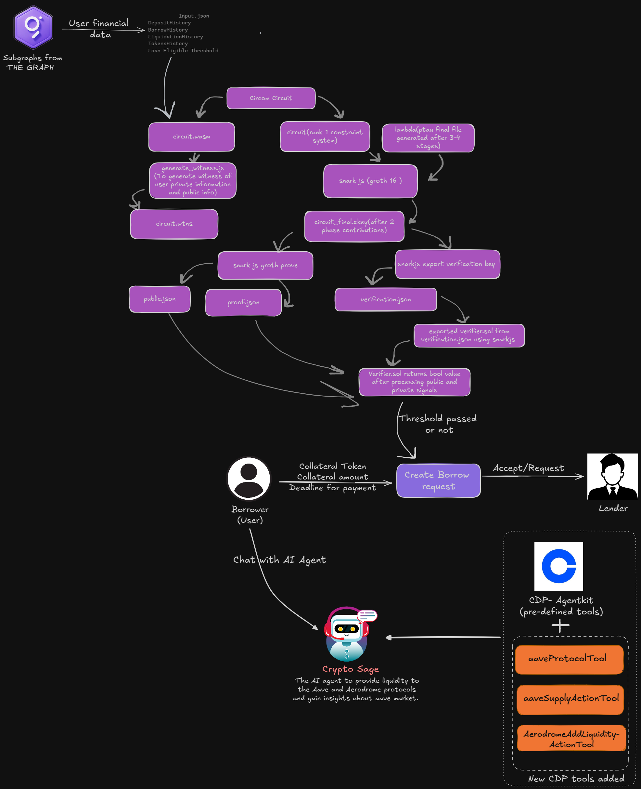
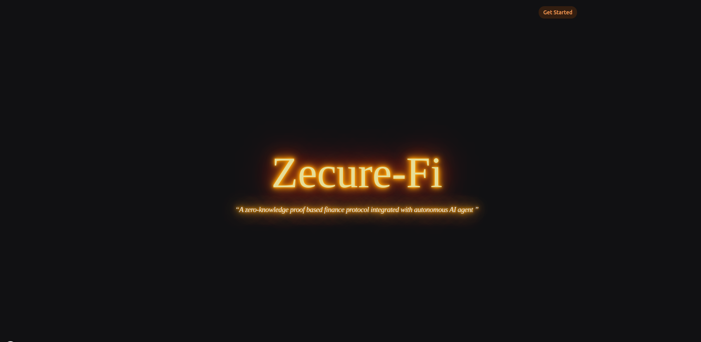
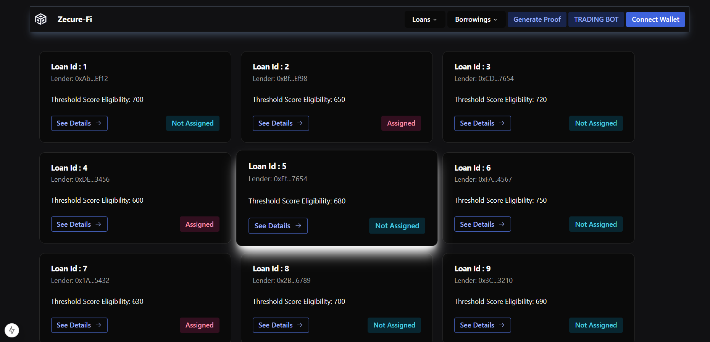
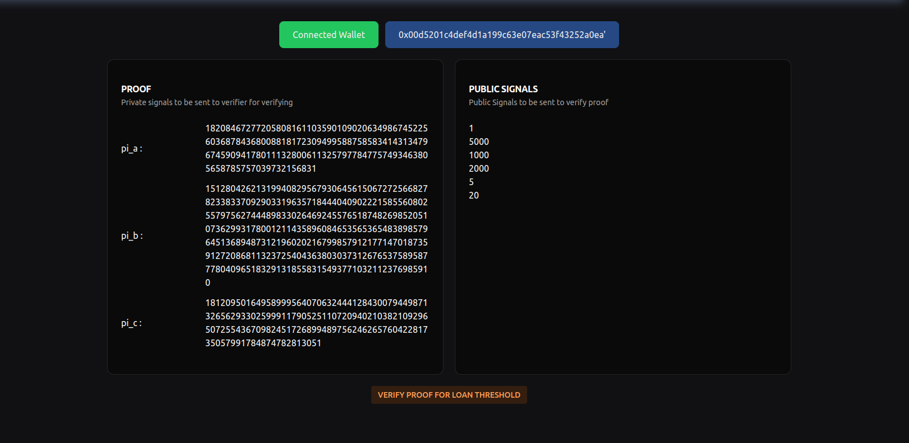
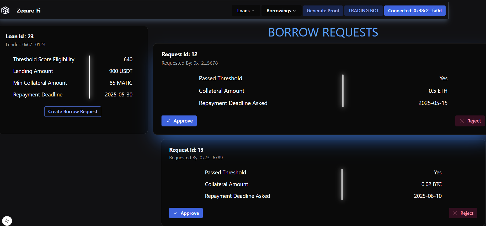
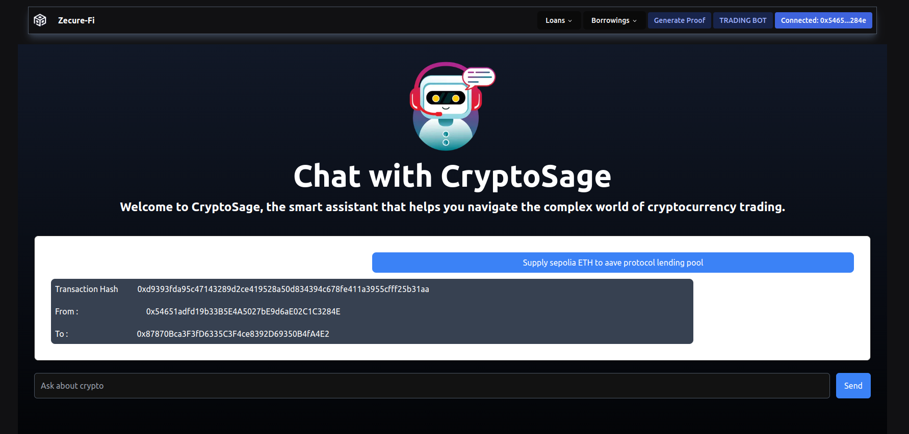

# ZecureFi

## ABOUT
**Zecure-Fi** is a **zero knowledge based lending protocol** powered by an **AI-agent** which helps borrowers secure **undercollaterized loans** from lenders by providing the lender their **financial history** at various **protocols and decentralized exchanges** in zero knowledge manner and gets **verified** for their financial status. Borrowers who meet or exceed the **loan threshold financial score**, set by lenders, can submit borrow requests, which lenders evaluate and approve or reject based on competing requests from other borrowers.

**AI agent** is built using Coinbase Agent Kit by **adding tools for various decentralized protocols and exchanges** and for every wallet address a new agent is made which helps in **trading** and making **estimate analysis of tokens and market** to the connected user in app.

## Architecture

## 

## Glimpses OF Zecure-Fi

## 


## 

## 

## 

## 

## PROJECT SETUP

- Clone the repository using :-

```
git clone https://github.com/kaurjasleen240305/No-name
                   or
git clone git@github.com:kaurjasleen240305/No-name.git
```

- To start the frontend run and check ```http://localhost:3000```:-
```
cd frontend
npm install
npm run dev
```

-To start the flask server for AI agent run and check ```http://localhost:5000```:-
```
pip install -r requirements.txt
python chatbot-flask.py
```